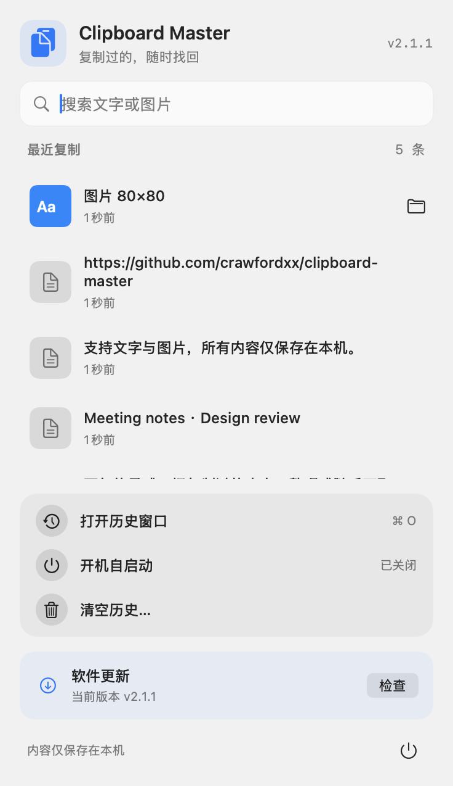

<p align="center">
  
</p>

<h1 align="center">Clipboard Master</h1>
<p align="center">
  <strong>复制过的，随时找回。</strong><br>
  原生 macOS 菜单栏 · Windows 托盘 · 文字与图片历史 · 本机存储
</p>

<p align="center">
  <a href="https://github.com/crawfordxx/clipboard-master/actions/workflows/ci.yml"></a>
  
  
  <a href="LICENSE"></a>
</p>

<p align="center">
  <a href="#界面预览">界面预览</a> ·
  <a href="#快速安装">快速安装</a> ·
  <a href="#日常使用">日常使用</a> ·
  <a href="#更新与故障处理">更新说明</a> ·
  <a href="https://github.com/crawfordxx/clipboard-master/issues">反馈问题</a>
</p>

复制了一段文字，又复制了另一段，前一段不必重新找。Clipboard Master 把最近复制的文字和图片留在菜单栏或托盘里，点击一条即可重新复制。

**不需要账号，不使用 Electron，不上传剪贴板内容。** macOS 使用 Swift / AppKit / SwiftUI，Windows 使用 C# / WinForms。

## 界面预览

### macOS：把常用操作收进一个浮层

<p align="center">
  <picture>
    <source media="(prefers-color-scheme: dark)" srcset="assets/readme/menu-dark.png">
    <source media="(prefers-color-scheme: light)" srcset="assets/readme/menu-light.png">
    
  </picture>
</p>

<p align="center"><sub>真实 SwiftUI 组件渲染，使用示例记录；随 GitHub 的明暗主题切换预览。封面与下方本机历史插画由 AI 生成，不是界面截图。</sub></p>

- **固定宽度，独立滚动**：长文本不会把菜单撑满屏幕，工具区始终在下面。
- **边输入边查找**：按文字内容或图片标签过滤；图片可直接在 Finder 中定位。
- **更清楚的反馈**：圆角悬停、键盘焦点、清空前确认；支持系统减少动画和透明度设置。
- **更新不打断工作**：检查、可更新、安装中与失败提示共用一个区域，不再定时弹窗猜测结果。

> 本页展示 `main` 分支的 macOS 改版。Windows 保留原生托盘菜单；两端界面并不相同。已发布版本以 [Releases](https://github.com/crawfordxx/clipboard-master/releases) 为准，可能与 `main` 不同。

## 快速安装

当前安装流程从源码构建，需要对应平台的开发工具。两个平台的安装脚本都在仓库中，可先阅读再执行。

### 交给你的 AI Agent

将下面这句话发给 Codex、Claude Code、Cursor 或其他能操作本机的 Agent：

> 帮我安装 Clipboard Master：https://github.com/crawfordxx/clipboard-master 。先阅读仓库的 AGENTS.md，按我的操作系统安装，并验证应用可以启动。

### macOS

需要 **macOS 14+** 和 **Xcode Command Line Tools**。如果没有 Swift 工具链，先运行 `xcode-select --install` 并完成系统安装向导。

```bash
git clone https://github.com/crawfordxx/clipboard-master.git
cd clipboard-master
./install.sh --launch
```

安装到 `/Applications/ClipboardMaster.app`。启动后在菜单栏显示图标，不占用 Dock。

### Windows

需要 **Windows 10 / 11**。从 PowerShell 运行；安装脚本会尝试通过 `winget` 安装缺失的 .NET 8 SDK。

```powershell
git clone https://github.com/crawfordxx/clipboard-master.git
cd clipboard-master
powershell -ExecutionPolicy Bypass -File install.ps1 -Launch
```

安装到 `%LOCALAPPDATA%\Programs\ClipboardMaster\`，启动后在系统托盘显示图标。

## 日常使用

| 想做什么 | 怎么操作 |
| --- | --- |
| 找回刚才复制的内容 | 点击菜单栏 / 托盘图标，再点一条历史记录；回到目标应用粘贴 |
| 找很久以前的一条 | 打开历史窗口，输入关键词过滤；双击复制 |
| 找到图片文件 | 点击图片的 Finder / 资源管理器入口 |
| 删除不需要的内容 | 在历史窗口删除单条；或清空全部历史 |
| 开机自动运行 | 在菜单中切换「开机自启动」 |

文字和图片**合计保留最近 200 条**。相同内容不会重复占位，再次复制会移到最前；退出后重新打开仍能读取已保存的历史。内容只会复制回剪贴板，**不会自动粘贴到其他应用**。

## 本机存储，不做云端同步

<p align="center">
  
</p>

- 剪贴板历史保存在本机，不发送到服务器；没有账户和云同步功能。
- 检查更新会连接 GitHub；执行更新还会拉取源码、构建并安装，不会上传历史内容。
- 会跳过系统或密码管理器明确标记为隐藏的剪贴板内容，但**不能保证识别所有密码或敏感信息**。
- 历史文件没有额外加密。请不要把它当作密码保险箱；设备上的其他有权限程序可能读取这些文件。

<details>
<summary><strong>数据位置、备份与卸载</strong></summary>

| 平台 | 历史与更新配置目录 |
| --- | --- |
| macOS | `~/Library/Application Support/ClipboardMaster/` |
| Windows | `%APPDATA%\ClipboardMaster\` |

备份时先退出应用，再复制整个数据目录。两端采用相同的 `history.json` 格式，图片文件单独存放；应用不会自动在设备间同步。

卸载 macOS 版可删除 `/Applications/ClipboardMaster.app`；Windows 可运行 `install.ps1 -Uninstall`。历史数据在独立目录，需要彻底清理时再手动删除。**清空历史不可撤销。**

</details>

## 更新与故障处理

### 应用内更新

macOS 启动后会判断距上一次成功检查是否超过 24 小时；也可以随时在菜单底部手动检查。检查期间保持加载状态，只有请求完成才显示结果；重复点击不会创建并行检查。

| 状态 | 接下来做什么 |
| --- | --- |
| 正在检查更新 | 等待 GitHub 响应；macOS 请求超时设为 15 秒 |
| 发现新版本 | 点击「更新」，获取对应版本源码、重新构建安装并自动重启 |
| 需要手动更新 | 源码克隆目录缺失，按提示查看发布页或使用下方源码更新流程 |
| 更新未完成 | 检查网络或权限后重试；有安装日志时可点击查看 |
| 源码有本地修改 | 自动更新不会覆盖这些改动，请先备份或提交后再更新 |

自动更新依赖安装时保存的源码路径，请不要随意删除或移动该克隆目录。历史目录与应用程序分开存放，安装脚本不会主动删除历史。

Windows 仍使用原有托盘更新流程。菜单交互与状态反馈的这次调整仅针对 macOS。

### 从源码更新

在此前的克隆目录中先检查并保存本地改动，再拉取代码。若处于 Release tag 的 detached HEAD，请先切回 `main`；不要强制丢弃自己的修改。

```bash
git status
git switch main
git pull --ff-only
```

退出正在运行的旧版，再运行对应安装命令：

```bash
# macOS
./install.sh --launch
```

```powershell
# Windows
powershell -ExecutionPolicy Bypass -File install.ps1 -Launch
```

<details>
<summary><strong>启动、登录项与日志排查</strong></summary>

- **macOS 没有窗口？** 默认只有菜单栏图标；点击「打开历史窗口」或运行 `open /Applications/ClipboardMaster.app --args --open-window`。
- **自启动没有生效？** 请从安装后的 `.app` 运行，并检查系统设置中的「登录项」。
- **检查失败？** 确认能访问 GitHub，稍后重试。macOS 检查失败不会消耗下一次自动检查的 24 小时间隔。
- **构建失败？** 检查 Swift / .NET SDK 是否可用。macOS 应用内更新日志位于数据目录内的 `update.log`；手动构建请查看终端输出。
- **升级后仍像旧版？** 退出旧进程，再打开新安装的应用；不要同时运行多份副本。

</details>

## 开发与贡献

运行 macOS 测试需要 **Swift 6 / Xcode 16+**（核心测试使用 Swift Testing）；CI 在 macOS 14 上显式选择 Xcode 16.2。

```bash
# macOS：核心库与更新器回归测试
swift test

# macOS：构建原生 .app
./scripts/build-app.sh

# Windows：核心库测试
dotnet test windows/ClipboardMaster.Core.Tests
```

当前 macOS 测试为 **49 项核心测试 + 8 项更新器测试 + 1 项浮层尺寸回归测试**。更新器测试使用模拟网络响应和临时脚本，不会安装应用或访问真实用户历史；CI 还会测试 Windows 核心库并构建托盘应用。

<details>
<summary><strong>项目结构</strong></summary>

```text
Sources/ClipboardMasterCore/      模型、存储、持久化、剪贴板监控
Sources/ClipboardMasterApp/       macOS 菜单浮层、历史窗口、更新器
Tests/                           macOS 单元与回归测试
windows/                         Windows 核心库、托盘应用和测试
assets/readme/                   README 插画与界面预览
scripts/                         构建、更新与发版脚本
VERSION                          构建使用的版本号
```

</details>

欢迎通过 [Issues](https://github.com/crawfordxx/clipboard-master/issues) 报告问题，或提交 Pull Request。涉及界面时请附系统版本和截图；日志与截图中请移除私人剪贴板内容。

开发约定见 [AGENTS.md](AGENTS.md)。维护者发版流程见 `scripts/release.sh`：更新 `VERSION`、提交、打 tag、推送并创建 GitHub Release。普通提交到 `main` 不等于已经发布新版本。

## License

[MIT](LICENSE) · 为日常复制粘贴保留一点记忆。
